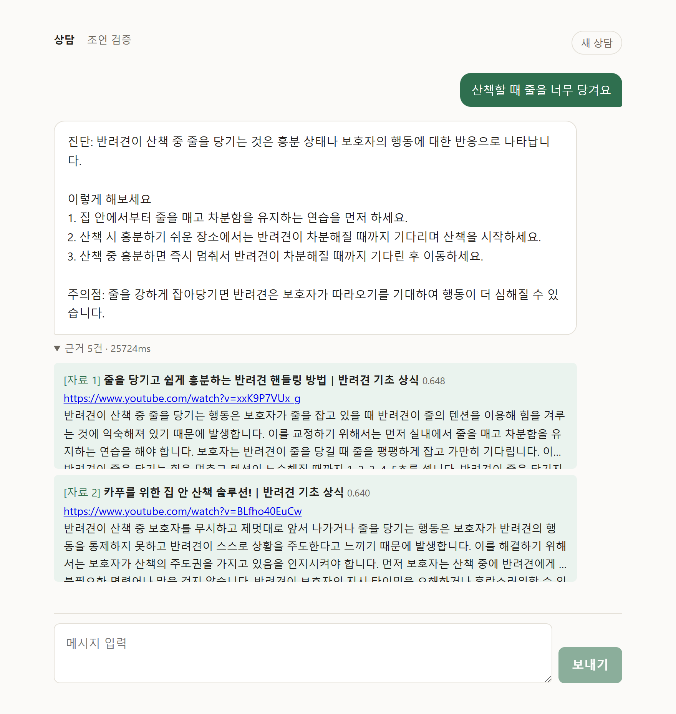
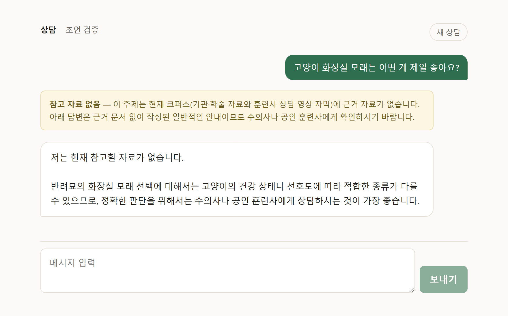
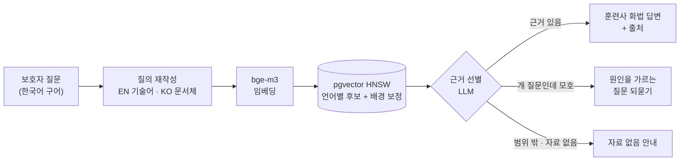

# 🐕 dog-behavior-rag

**반려견 문제행동·훈련 상담 RAG.** 근거가 있으면 출처를 붙여 답하고,
근거가 없으면 모른다고 말한다.


| 근거가 있으면 — 출처와 함께 답한다 | 근거가 없으면 — 없다고 말한다 |
|---|---|
|  |  |

<sub>실제 실행 화면 (로컬 gemma-4-e2b · 코퍼스 613건 / 9,755청크, 2026-09-15)</sub>

---

## 왜 만들었나

강아지 행동 문제를 검색하면 조언이 넘친다. 그중 상당수가 "서열을 잡아라",
"복종 자세로 눌러라" 같은 **지배이론 기반 훈련법**인데, 이건 미국 수의동물행동학회
(AVSAB)가 공식 성명으로 반박한 방법이다. 일반 LLM에 물어도 사정이 크게 다르지 않다.
그럴듯한 답은 나오지만 어디서 온 말인지 알 수 없다.

그래서 **출처가 확인된 자료만으로 답하는 상담기**를 만들었다. 핵심은
검색보다 **"포기할 줄 아는 것"**이었다.

## 무엇이 다른가

| | 일반 LLM 챗봇 | 이 프로젝트 |
|---|---|---|
| 자료에 없는 주제 | 그럴듯하게 지어낸다 | **"자료가 없다"고 말한다** — 범위 밖 질문 거절률 0/4 → 4/4 |
| 원인이 여러 갈래인 질문 | 가능성을 전부 나열한다 | 훈련사처럼 **원인을 가르는 질문을 되묻는다** |
| 답변의 근거 | 알 수 없다 | 답변이 `[자료 N]`으로 인용하고, 같은 번호의 근거 카드에서 원문 청크를 볼 수 있다 |
| 인터넷에서 본 조언 | — | **팩트체크 모드** — 붙여넣으면 주장별로 *근거 있음 / 자료와 배치 / 자료 없음*을 판정 |

## 동작 방식



1. **질의를 언어별로 나눈다.** 코퍼스가 영어 논문과 한국어 영상 자막 두 덩어리라,
   영어 기술 표현("leash pulling")과 한국어 문서체("산책 중 줄을 당기는 행동")를
   따로 만들어 각자 자기 언어 풀을 검색한다. 한 벡터에 섞으면 어느 쪽도 제대로 못 찾았다
2. **언어 배경을 뺀다.** 한국어 질문에는 한국어 문서가 주제와 무관해도 더 가깝게 나온다.
   "그 언어 문서 전체보다 얼마나 튀는가"로 순위를 매긴다. 평균 유사도 = 중심 벡터와의
   내적이라서 스캔 없이 벡터 하나로 계산한다(139ms → 2ms)
3. **근거를 LLM이 고른다.** 검색은 무조건 top-k를 돌려준다. 이 단계가 없으면
   "중성화 비용"에도 가장 덜 무관한 5건을 붙여 답을 만든다
4. **형식은 코드로 보장한다.** 답변 폼(진단 → 단계 → 주의점)을 벗어난 사족은 프롬프트로
   막지 않고 `trim_to_form`이 잘라낸다. 1,200자 → 300자

## 숫자로 본 과정

평가셋 없이 코퍼스를 25배 늘렸다가 체감이 그대로인 걸 뒤늦게 안 뒤로는
**모든 변경을 재고 나서 채택**했다.

**보호자 말투 수작업 평가셋** (`data/eval_questions.yaml`, 거절해야 통과하는 문항 포함)

| 단계 | 통과 | 무엇이 바뀌었나 |
|---|---|---|
| 기준선 | 10/20 | 범위 밖 질문 0/4 — 전부 답했다 |
| + 근거 선별 LLM | 16/20 | **범위 밖 4/4** |
| + 문서 유형 부스트 | 17/20 | 실무 가이드가 상위 5개 중 1.8 → 3.5개 |
| + 문서당 청크 상한 2 → 3 | 19/21 | 정답이 같은 문서의 세 번째 청크인 경우 |
| + HNSW 탐색폭 40 → 400 | 20/21 | 근사 검색이 한국어 청크를 못 찾고 있었다 |
| 32문항으로 확장 + 언어별 질의 | 24 → 25/32 | 구어체 질문("똥을 먹어요")이 한국어 문서에 닿기 시작했다 |
| 34문항 · LLM을 로컬 gemma → Gemini (3회 측정) | 27 → 28~30/34 | 범위 밖 5/7 → **7/7 (3회 모두)** |

**청크에서 자동 생성한 581문항** — hit@5 47.7% → **51.8%** (언어별 질의 채택)

**멀티턴 재현 검사** — 세 번째 답변이 첫 답변과 겹치는 비율 83% → 33%

## 틀린 걸 찾아낸 기록

잘 된 결과보다 **조용히 틀리고 있던 것을 찾은 과정**이 이 프로젝트의 대부분이다.
전체 기록은 [`CLAUDE.md`](CLAUDE.md)와 [`docs/learn/`](docs/learn/00-checklist.md)에 있다.

- **검색이 에러 없이 틀렸다.** HNSW 기본 탐색폭(40)으로는 전체의 2.9%인 한국어 청크에
  닿지 못했다. 정확 검색(`enable_indexscan=off`)과 대조하니 "줄당김" 질문의 진짜 상위 5개가
  통째로 빠져 있었다
- **청킹이 마침표를 지우고 있었다.** `str.split(". ")`이 구분자를 먹었다. "청크 42%가
  문장 중간에서 끊긴다"를 청킹 전략 문제로 읽었는데 코드 버그였다(42% → 21%)
- **리랭커를 붙였더니 hit@5가 59% → 38%로 떨어졌다.** 30초짜리 검사로 원인이 나왔다.
  영→영 0.9972, 한→영 **0.0001**. 교차언어를 아예 못 하는 모델이 관련도가 아니라
  언어로 정렬하고 있었다
- **답변 반복은 모델 한계가 아니었다.** "작은 모델이라 반복한다"고 결론 냈다가 틀렸다.
  답변 폼이 판단형 질문을 담지 못해 **채울 게 없으니 앞 답변을 복사한** 것이었다.
  더 강한 모델(Gemini)은 같은 결함을 능력으로 가리고 있었다
- **평가셋 자체가 틀렸다.** 키워드 판정에서 `tail`이 *detail*에, `aging`이 *managing*에
  걸렸고, "자료 없음"으로 라벨한 질문의 자료가 코퍼스에 있었다. 기본 평가셋 경로가
  낡아 **1문항으로 hit@5 100%**가 찍힌 적도 있다. 그 뒤로 판정 함수에도 테스트를 붙였다
- **실패한 실험도 남겼다.** RRF 융합, z점수 표준화, 한 호출에 두 언어 시키기, 정제 프롬프트
  A/B는 모두 기각했다. 무엇이 틀렸는지 적어두었고, 언어별 질의는 1차 기각(−6.2%p) 후
  원인을 고쳐 2차에 채택했다(+4.1%p)

## 데이터

| 소스 | 규모 | 언어 | 비고 |
|---|---|---|---|
| PMC 오픈액세스 논문 + AVSAB · RSPCA · ASPCA 등 기관 가이드 | 294건 | 영어 | 논문은 대부분 CC-BY, `[tiab]` 질의로 주제를 좁혀 수집. ASPCA는 ToS상 자동 수집이 금지돼 수동 저장 |
| 강형욱의 보듬TV 자막 | 328편 | 한국어 | 자동 자막을 LLM으로 정제. 개인·학습 목적 이용 |

**합계 622건 · 청크 9,911개.** 수집 대상은 `data/sources.yaml`에 선언하고, 각 소스의
라이선스 판정 근거를 ToS 원문 인용으로 남긴다. `license: pending-check`인 소스는
수집기가 거부한다. 지배이론이 섞일 수 있는 자료는 `corpus=observation` 구획에 따로 두고,
검색이 `corpus='answer'`를 하드코딩으로 걸어 답변 근거에서 격리한다.

## 기술 스택

| 영역 | 사용 |
|---|---|
| API | FastAPI, SQLAlchemy (async), Pydantic |
| 검색 | PostgreSQL + pgvector (HNSW), `BAAI/bge-m3` (1024차원, 다국어) |
| LLM | Gemini 무료 티어(`gemini-3.1-flash-lite`, 기본) · LM Studio 로컬(`gemma-4-e2b`)로도 동작. OpenAI 호환 프로토콜이라 `LLM_BASE_URL`만 바꾸면 교체 |
| 화면 | Next.js — 상담 채팅(멀티턴, 근거 접기) · 팩트체크 |
| 평가 | 수작업 32문항 · 자동 생성 581문항 · 멀티턴 재현 · LLM-as-judge |
| 도구 | uv, ruff, mypy, pytest |

## 빠른 시작

```bash
uv sync
cp .env.example .env            # LLM_BASE_URL / LLM_API_KEY 설정
uv run uvicorn app.main:app --reload
# → http://localhost:8000/docs
```

수집 → DB → 적재 → 화면까지 전체 절차, LLM 설정, 평가 명령은
**[docs/guide.md](docs/guide.md)** 에 있다.

## 문서 지도

| 문서 | 내용 |
|---|---|
| [docs/guide.md](docs/guide.md) | 설치·수집·적재·평가·LLM 설정 전체 매뉴얼 |
| [docs/learn/](docs/learn/00-checklist.md) | RAG를 이 레포의 실제 숫자로 따라가는 학습 노트 (EDA·청킹·임베딩 선정·하이브리드 검색·LLM-as-judge) |
| [docs/erd.md](docs/erd.md) | DB 스키마와 필드별 근거 |
| [CLAUDE.md](CLAUDE.md) | 판단 규칙과 실험 기록 — 무엇을 왜 기각했는지 |

## 한계와 다음 단계

- **로컬 모델은 질문의 방향을 못 가렸다.** "혼자 있을 때 배변을 안 해"(억제된 배변)에
  로컬 gemma가 반대 패턴("혼자 있을 때 실내에 배변한다") 문서를 근거로 붙여 답했다.
  프롬프트 규칙·판정 분리·영어 재진술 세 가지로 고쳐봤지만 셋 다 안 됐고, 같은
  프롬프트를 Gemini로 돌리니 거절했다 — 설계가 아니라 4.6B 모델의 한계였다.
  그래서 **Gemini를 기본으로 바꿨고** 3회 측정 모두 거절한다(2026-09-15)
- **Gemini의 질의 재작성이 두 질문을 망친다.** 크레이트·깨물기 질문에서 재작성이
  "desensitization and counterconditioning" 같은 기법명을 덧붙여 방법론 문서가 상위를
  채운다(3회 모두). 근거 선별은 그 문서들을 맞게 버리지만 답할 근거가 안 남는다.
  재작성이 기법명을 덧붙이지 않게 하는 게 다음 과제다
- **무료 티어라 호출 한도(429)에 걸린다.** 재시도로 버티지만 끝내 실패하면 검색을
  원문으로 하는 폴백이라 조용히 품질이 떨어질 수 있다
- **범위 판정이 흔들리는 문항이 둘 있다.** 같은 질문을 6번 물으면 "훈련사 자격증"은 1/6,
  "슬개골 탈구 수술"은 3/6 비율로 개 질문으로 판정된다. 판정 프롬프트를 고칠 차례다
- **보듬TV 자막은 개인·학습 목적으로만 쓴다.** 앱으로 배포하려면 이 소스를 빼거나
  권리자 허락을 받아야 한다. 논문·기관 자료만으로 돌리는 설정은 `corpus` 필드로 바로 된다
- 다음: Alembic 마이그레이션 → 안드로이드 앱
