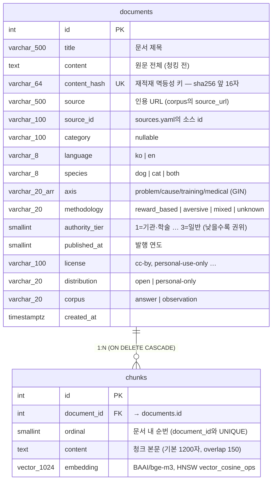

# ERD — GY_RAG

`app/db/models.py`가 원본이다. **스키마를 고치면 이 문서도 같이 고칠 것.**

테이블은 두 개뿐이다. 원문 1건 = `documents` 1행, 검색 단위 1개 = `chunks` 1행.
메타데이터를 전부 `documents`에 두고 `chunks`는 조인으로 닿는다.



## 인덱스

| 테이블 | 인덱스 | 왜 |
|---|---|---|
| `chunks` | `ix_chunks_embedding` — **HNSW** `(embedding vector_cosine_ops)` `m=16, ef_construction=64` | 코사인 ANN 검색. 임베딩을 `normalize_embeddings=True`로 넣으므로 연산자와 일치한다 |
| `chunks` | `ix_chunks_document_id` (btree) | 문서 삭제 시 CASCADE, 문서별 청크 수 집계 |
| `chunks` | `uq_chunks_document_ordinal` (unique) | 같은 문서를 두 번 적재하면 여기서 걸린다 |
| `documents` | `documents_content_hash_key` (unique) | **멱등성의 핵심.** 재적재가 임베딩을 다시 계산하지 않는다 |
| `documents` | `ix_documents_methodology`, `ix_documents_corpus` (btree) | 두 컬럼 모두 **모든** 검색의 WHERE 절에 들어간다 |
| `documents` | `ix_documents_axis` (**GIN**) | `axis && ARRAY[...]` 겹침 조회 (축별 커버리지) |

## 필드가 존재하는 이유

장식이 아니라 전부 동작에 걸려 있는 값들이다.

- **`content_hash`** — 재적재 멱등성. `scripts/collect/normalize.py`가 만든 값을 그대로
  받는다. unique 제약이 있어서 `load_corpus`를 몇 번 돌려도 임베딩을 다시 계산하지 않는다.
  값이 `app/services/ingest_service.py:content_hash`와 갈라지면 문서가 매번 중복 적재되므로
  `tests/test_corpus_mapping.py`가 기댓값을 박아 고정하고 있다.

- **`methodology`** — `aversive`는 검색에서 **하드코딩으로 제외**된다
  (`app/services/vectorstore/pgvector.py`). 혐오 기반 훈련법은 AVSAB 문서가 정면으로
  반박하는 내용이라, 같은 답변의 근거로 들어가면 답이 자기모순에 빠진다.

- **`corpus`** — `observation`은 답변 근거에서 격리된다. 블로그처럼 지배이론이 섞일 수
  있는 자료를 여기 둔다. 검색이 `corpus = 'answer'`를 하드코딩으로 걸기 때문에
  호출자가 실수로 켤 수 없다. 용도는 "사람들이 어떤 말로 묻는가"를 보는 것뿐이다.

- **`distribution`** — 앱 배포 시 코퍼스에서 뺄 문서를 한 필드로 거른다. license 문자열을
  매번 매칭하지 않으려고 적재 시점에 정규화한다. 모르는 값은 보수적으로 `personal-only`다
  — 분류를 빠뜨린 문서가 조용히 배포 대상이 되면 안 된다.
  (2026-08-12 기준 274건 중 `open` 267 / `personal-only` 7)

- **`authority_tier`** — 검색 부스팅 신호. **낮을수록 권위가 높다.**
  `(1 - distance) + 0.02 * (3 - tier) / 2`로 근소한 차이만 뒤집는다.

- **`axis`** — 코퍼스 커버리지 측정용. `ARRAY`인 이유는 4값 고정 어휘라서 `&&`와 GIN을
  바로 쓸 수 있기 때문이다 (JSONB는 스키마 없는 페이로드용).

- **`ordinal`** — 지금 검색에는 안 쓰지만 이웃 청크 확장("적중 청크의 다음 것도 같이
  보여주기")과 디버깅에 필요하고 비용이 0이다.

## 의도적으로 하지 않은 것

- **`methodology`/`authority_tier`를 `chunks`에 비정규화하지 않았다.** 문서 수백 건
  규모에서 조인은 사실상 공짜다. 청크가 10만 개를 넘고 `aversive` 문서가 실제로 생기면
  그때는 ANN 후필터가 후보를 잃기 시작하므로, 두 컬럼을 복제하거나
  `WHERE methodology <> 'aversive'` 부분 인덱스를 만들어야 한다.

- **Alembic을 쓰지 않는다.** 임베딩 차원과 메타 컬럼이 아직 흔들리는 단계라
  마이그레이션 이력이 오히려 짐이다. `scripts.db.init --drop`으로 다시 만들고
  `load_corpus`로 몇 분 안에 재적재하는 편이 빠르고 정확하다.

## 차원을 바꿀 때

`EMBEDDING_DIM`은 `chunks.embedding`의 `vector(N)`과 **반드시** 같아야 한다.
모델을 바꾸면:

```bash
# .env의 EMBEDDING_DIM과 HF_EMBEDDING_MODEL을 함께 수정한 뒤
uv run python -m scripts.db.init --drop
uv run python -m scripts.db.load_corpus
```

불일치 상태로 두면 임베더 warmup이 즉시 죽는다 — pgvector INSERT까지 가서
훨씬 불친절하게 터지는 것보다 낫기 때문에 일부러 그렇게 했다.
